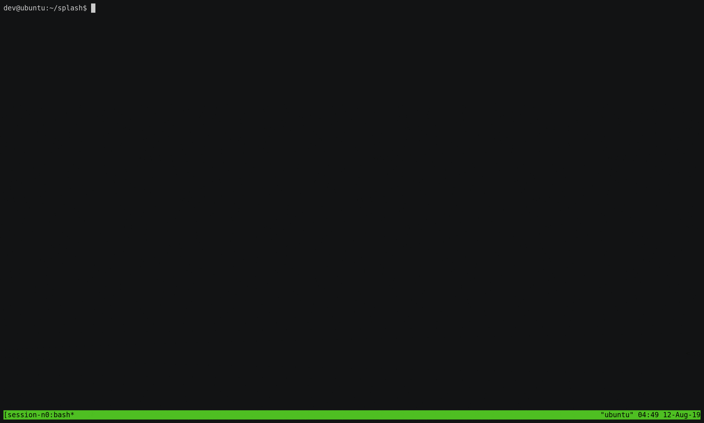

```
   _____        ____        __        ___         _____      __  __   
  / ___/       / __ \      / /       /   |       / ___/     / / / /   
  \__ \       / /_/ /     / /       / /| |       \__ \     / /_/ /      
 ___/ /      / ____/     / /___    / ___ |      ___/ /    / __  /      
/____/plash /_/seudo    /_____/   /_/  |_|mbda /____/    /_/ /_/ell  
```
A pseudo shell re-invoking the Lambda for each command.

For curious fellows who want to hack on AWS Lambda's infrastructure. 



# Features
- Supports CWD
- File transfers between the local machine and the Lambda
- Tracking Lambda writable file system (/tmp) resets 
- Pretty colors

# Why Not a Reverse Shell
Lambda is priced according to run time. A reverse shell running for a couple of minutes will be costly.
Additionally, after some time the Lambda will timeout and the reverse shell connection will be closed.

# Getting Started
**Dependencies**

Python3, termcolor.
```
$ sudo apt update && sudo apt install python3 python3-pip
$ pip3 install termcolor
```
**Install and Setup**
```
$ git clone https://github.com/twistlock/splash && cd splash

# Deploy ./deploy/lex.zip to an AWS Lambda through the aws CLI or the web UI.
# set Runtime:Python3.7, Handler:lex.handler, and add an API Gateway trigger.

$ ./splash.py config addr <Lambda-addr>
$ ./splash.py  # run splash
```

# Components
 - **SPLASH** - the shell
 - **LEX** (Lambda Executor) - the Lambda function that executes splash's commands
 - lbcmd.py - a simple utility for running bash commands on Lambdas
 - lib - python modules
 - deploy/lex.zip - a Lambda python package containing `lex.py` and `lib/general_utils.py`. 


# Help
```
   _____        ____        __        ___         _____      __  __   
  / ___/       / __ \      / /       /   |       / ___/     / / / /   
  \__ \       / /_/ /     / /       / /| |       \__ \     / /_/ /      
 ___/ /      / ____/     / /___    / ___ |      ___/ /    / __  /      
/____/plash /_/seudo    /_____/   /_/  |_|mbda /____/    /_/ /_/ell  

A pseudo shell re-invoking the Lambda for each command.
\t -> SPLASH runs on your local machine.
\t -> LEX (Lambda Executor) should run on your Lambda.

To support certain features splash will run simple commands on the Lambda behind the scenes
(e.g. 'whoami' to get the user name)

-------------------------------------------------------------------

# Configuration:
  -> splash config addr <lambda-addr>
  -> splash config trackfs <true/false> - track resets of the filesystem (the writable dir at '/tmp'), slows splash significantly.  
  -> splash config color <true/false> - enable/disable coloring

# Special Commands:
  -> Enter 'q' to exit. 
  -> Enter '!gt(b) <lambda-path> <local-path>' to get a file to your local machine, '--gtb' is for binary mode.
  -> Enter '!pt(b) <local-path> <lambda-path>' to put a file on the Lamda, '--ptb' is for binary mode.
  -> Enter '!help' to display this message while in a shell session

# Known Limitations:
  -> Currently only works with open API Gateway endpoints.
  -> Does not support enviroment variables.
  -> File transfers are limited to the Lambda's max request/response size (6MB). splash will try to tar larger files.
  If the file is still too large, consider running 'curl -F ‘data=@path/to/lambda/file’ <your-server-address>' in splash.
  -> Limited support for CWD tracking. 
    * Supported by tracking 'cd' commands to identify the CWD, and then inserting "cd CWD; " to the start of shell commands.
    * Piping commands with 'cd' isn't supported (i.e. "cd /tmp ; echo A")
    * cd into an absolute path with '..' or '.' isn't supported (i.e. "cd /tmp/../tmp")
    * splash can get 'stuck' in a deleted directory, run 'cd' to reset CWD
```

# TODO
- Add support for API Gateway authentication (API Key, IAM)
